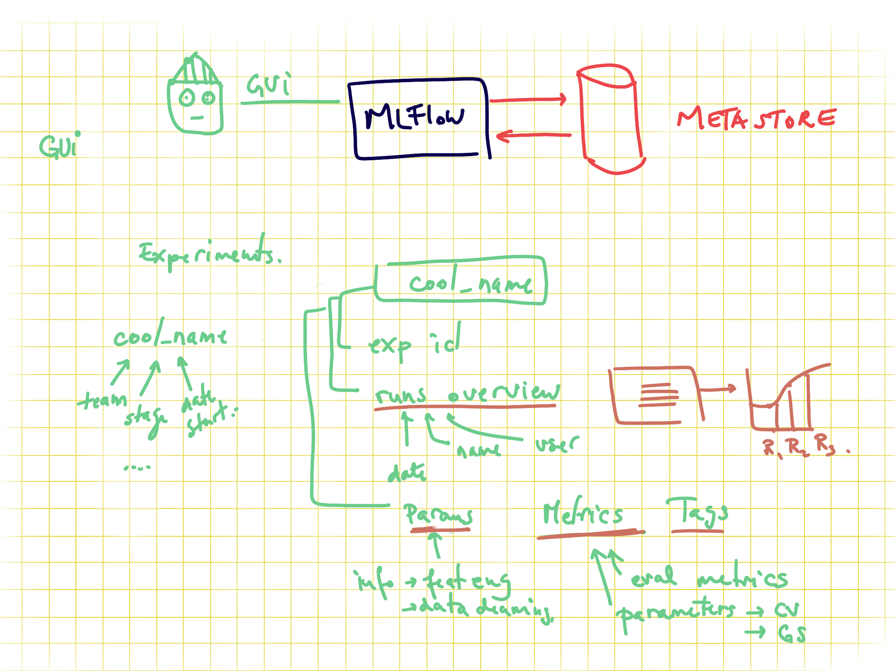
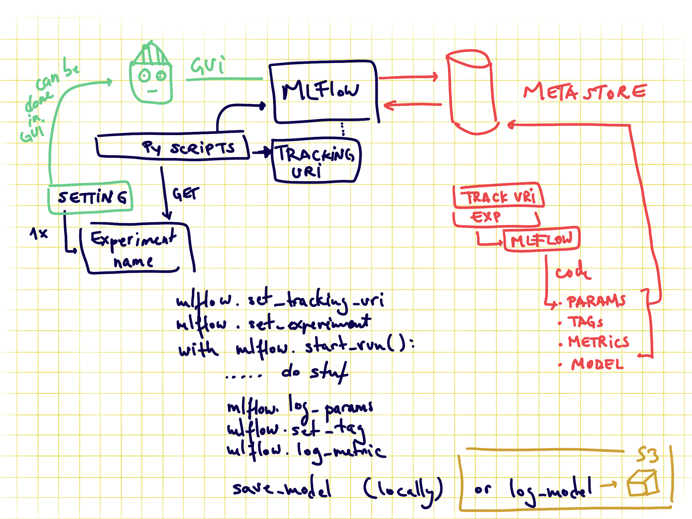
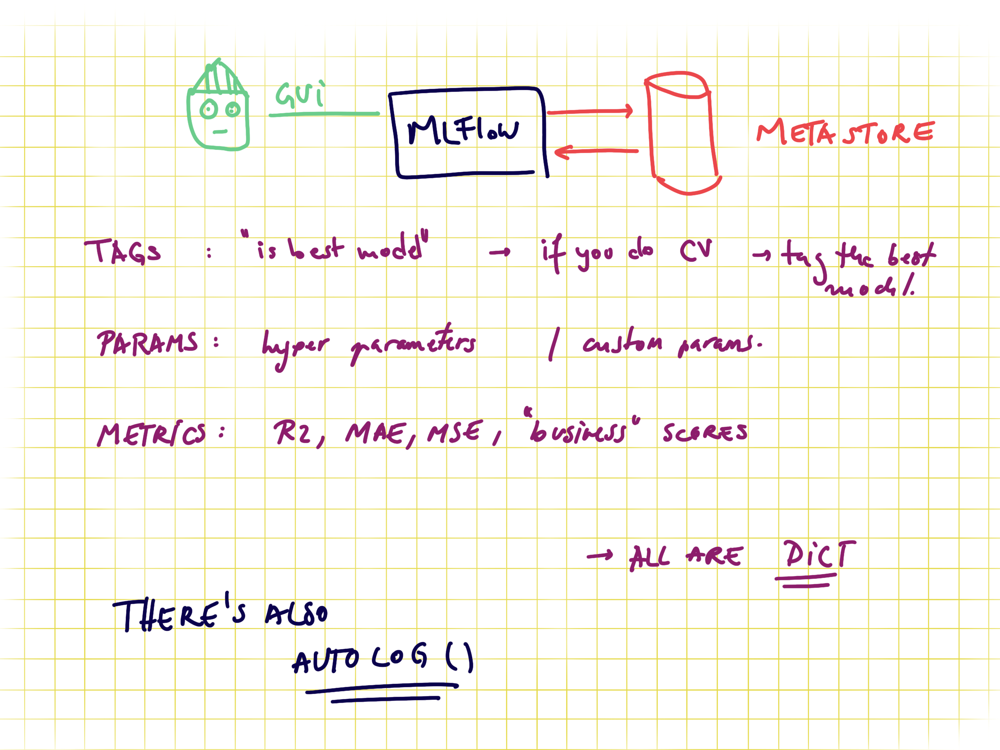

# Link to dashboard repository:

https://github.com/christinarudolf/fight-the-flu-dash

# The features in this dataset
You are provided a dataset with 36 columns. The first column respondent_id is a unique and random identifier. The remaining 35 features are described below.

For all binary variables: 0 = No; 1 = Yes.

h1n1_concern - Level of concern about the H1N1 flu.
0 = Not at all concerned; 1 = Not very concerned; 2 = Somewhat concerned; 3 = Very concerned.
h1n1_knowledge - Level of knowledge about H1N1 flu.
0 = No knowledge; 1 = A little knowledge; 2 = A lot of knowledge.
behavioral_antiviral_meds - Has taken antiviral medications. (binary)
behavioral_avoidance - Has avoided close contact with others with flu-like symptoms. (binary)
behavioral_face_mask - Has bought a face mask. (binary)
behavioral_wash_hands - Has frequently washed hands or used hand sanitizer. (binary)
behavioral_large_gatherings - Has reduced time at large gatherings. (binary)
behavioral_outside_home - Has reduced contact with people outside of own household. (binary)
behavioral_touch_face - Has avoided touching eyes, nose, or mouth. (binary)
doctor_recc_h1n1 - H1N1 flu vaccine was recommended by doctor. (binary)
doctor_recc_seasonal - Seasonal flu vaccine was recommended by doctor. (binary)
chronic_med_condition - Has any of the following chronic medical conditions: asthma or an other lung condition, diabetes, a heart condition, a kidney condition, sickle cell anemia or other anemia, a neurological or neuromuscular condition, a liver condition, or a weakened immune system caused by a chronic illness or by medicines taken for a chronic illness. (binary)
child_under_6_months - Has regular close contact with a child under the age of six months. (binary)
health_worker - Is a healthcare worker. (binary)
health_insurance - Has health insurance. (binary)
opinion_h1n1_vacc_effective - Respondent's opinion about H1N1 vaccine effectiveness.
1 = Not at all effective; 2 = Not very effective; 3 = Don't know; 4 = Somewhat effective; 5 = Very effective.
opinion_h1n1_risk - Respondent's opinion about risk of getting sick with H1N1 flu without vaccine.
1 = Very Low; 2 = Somewhat low; 3 = Don't know; 4 = Somewhat high; 5 = Very high.
opinion_h1n1_sick_from_vacc - Respondent's worry of getting sick from taking H1N1 vaccine.
1 = Not at all worried; 2 = Not very worried; 3 = Don't know; 4 = Somewhat worried; 5 = Very worried.
opinion_seas_vacc_effective - Respondent's opinion about seasonal flu vaccine effectiveness.
1 = Not at all effective; 2 = Not very effective; 3 = Don't know; 4 = Somewhat effective; 5 = Very effective.
opinion_seas_risk - Respondent's opinion about risk of getting sick with seasonal flu without vaccine.
1 = Very Low; 2 = Somewhat low; 3 = Don't know; 4 = Somewhat high; 5 = Very high.
opinion_seas_sick_from_vacc - Respondent's worry of getting sick from taking seasonal flu vaccine.
1 = Not at all worried; 2 = Not very worried; 3 = Don't know; 4 = Somewhat worried; 5 = Very worried.
age_group - Age group of respondent.
education - Self-reported education level.
race - Race of respondent.
sex - Sex of respondent.
income_poverty - Household annual income of respondent with respect to 2008 Census poverty thresholds.
marital_status - Marital status of respondent.
rent_or_own - Housing situation of respondent.
employment_status - Employment status of respondent.
hhs_geo_region - Respondent's residence using a 10-region geographic classification defined by the U.S. Dept. of Health and Human Services. Values are represented as short random character strings.
census_msa - Respondent's residence within metropolitan statistical areas (MSA) as defined by the U.S. Census.
household_adults - Number of other adults in household, top-coded to 3.
household_children - Number of children in household, top-coded to 3.
employment_industry - Type of industry respondent is employed in. Values are represented as short random character strings.
employment_occupation - Type of occupation of respondent. Values are represented as short random character strings.
# ds-modeling-pipeline

Skeleton project for building a simple model in python script
This is the simplest way to do it. We train a simple model in the jupyter notebook, where we select only some features and do minimal cleaning. The output is then stored in simple python scripts.

Data used is the [coffee quality dataset](https://github.com/jldbc/coffee-quality-database).

##

Requirements:

- pyenv with Python: 3.8.5

### Setup

Same procedure as last time...

Use the requirements file in this repo to create a new environment.

```BASH
make setup

#or

pyenv local 3.8.5
python -m venv .venv
pip install --upgrade pip
pip install -r requirements_dev.txt
```

The requirements.txt file contains the libraries needed for deployment.. of model or dashboard .. thus no jupyter or other libs used during development.

The MLFLOW URI should not be stored on git, you have two options, to save it locally in the .mlflow_uri file:

```BASH
echo http://127.0.0.1:5000/ > .mlflow_uri
```

this will create a local file where the uri is stored. Alternatively you can export it as an environment variable with

```bash
export MLFLOW_URI=http://127.0.0.1:5000/
```

This links to your local mlflow, if you want to use a different one, then change the set uri.

The code in the [config.py](modeling/config.py) will try to read it locally and if the file doesn't exist will look in the env var.. IF that is not set the URI will be empty in your code.

## Usage

### Creating an MLFlow experiment

You can do it via the GUI or via [command line](https://www.mlflow.org/docs/latest/tracking.html#managing-experiments-and-runs-with-the-tracking-service-api) if you use the local mlflow:

```bash
mlflow experiments create --experiment-name 0-template-ds-modeling
```

Check your local mlflow

```bash
mlflow ui
```

and open the link [http://127.0.0.1:5000](http://127.0.0.1:5000)

This will throw an error if the experiment already exists. Save the experiment name in the [config file](modeling/config.py)

In order to train the model and store test data in the data folder and the model in models run:

```bash
#activate env
source .venv/bin/activate

python -m modeling.train
```

In order to test that predict works on a test set you created run:

```bash
python modeling/predict.py models/linear data/X_test.csv data/y_test.csv
```

## About MLFLOW -- delete this when using the template

MLFlow is a tool for tracking ML experiments. You can run it locally or remotely. It stores all the information about experiments in a database.
And you can see the overview via the GUI or access it via APIs. Sending data to mlflow is done via APIs. And with mlflow you can also store models on S3 where you version them and tag them as production for serving them in production.


### MLFlow GUI

You can group model trainings in experiments. The granularity of what an experiment is up to your usecase. Recommended is to have an experiment per data product, as for all the runs in an experiment you can compare the results.


### Code to send data to MLFlow

In order to send data about your model you need to set the connection information, via the tracking uri and also the experiment name (otherwise the default one is used). One run represents a model, and all the rest is metadata. For example if you want to save train MSE, test MSE and validation MSE you need to name them as 3 different metrics.
If you are doing CV you can set the tracking as nested.


### MLFlow metadata

There is no constraint between runs to have the same metadata tracked. I.e. for one run you can track different tags, different metrics, and different parameters (in cv some parameters might not exist for some runs so this .. makes sense to be flexible).

- tags can be anything you want.. like if you do CV you might want to tag the best model as "best"
- params are perfect for hypermeters and also for information about the data pipeline you use, if you scaling vs normalization and so on
- metrics.. should be numeric values as these can get plotted


